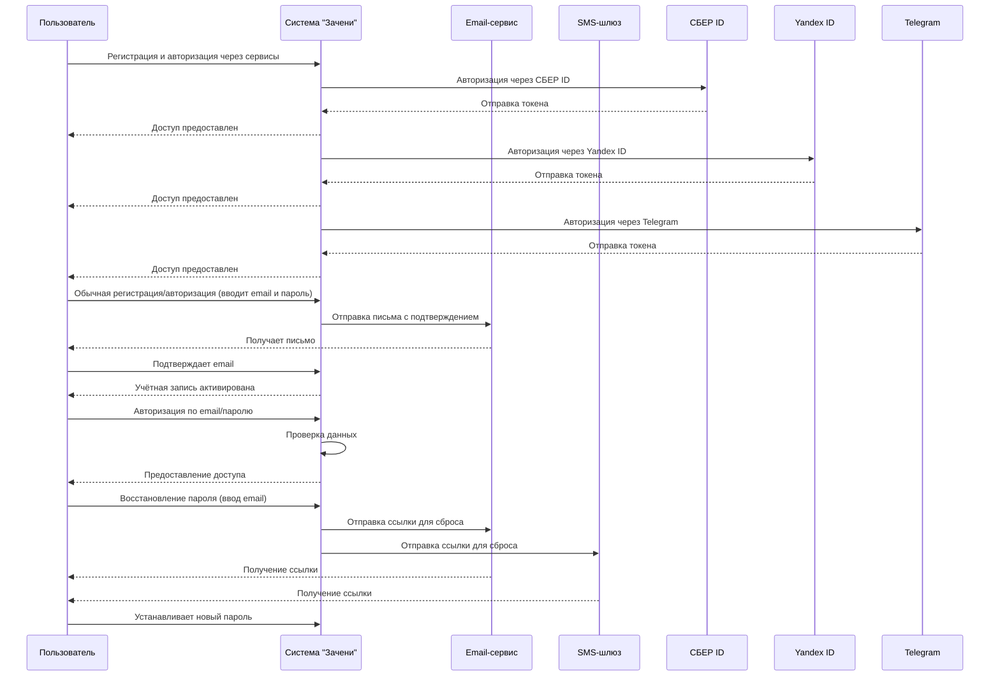

## **Техническое задание (ТЗ)**

**Проект:** Система регистрации и авторизации пользователей сервиса «Зацени»  
**Документ основан на:** Use Case 1: Регистрация/Авторизация Пользователя

---

### **1. Цель**

Реализовать систему аутентификации и управления учетными записями пользователей с поддержкой:

- Регистрации по email
    
- Авторизации по email
    
- Восстановления пароля
    
- Авторизации через внешние сервисы: СБЕР ID, Yandex ID, Telegram
    

---

### **2. Пользовательские роли**

- **Пользователь (Клиент)**: получает базовый доступ к функционалу личного кабинета после успешной авторизации.
    

---

### **3. Функциональные требования**

#### **3.1 Регистрация по email**

- Пользователь вводит email и пароль.
    
- Система отправляет письмо с подтверждением регистрации.
    
- После перехода по ссылке из письма, аккаунт активируется.
    

#### **3.2 Авторизация по email**

- Пользователь вводит email и пароль.
    
- Система проверяет введённые данные.
    
- В случае успеха — пользователь получает доступ к личному кабинету.
    

#### **3.3 Восстановление пароля**

- Пользователь вводит email.
    
- Система отправляет ссылку для восстановления через email или SMS.
    
- Пользователь устанавливает новый пароль по ссылке.
    

#### **3.4 Авторизация через внешние сервисы**

- Поддерживаемые сервисы: СБЕР ID, Yandex ID, Telegram.
    
- Пользователь выбирает сервис.
    
- Система перенаправляет на страницу авторизации сервиса.
    
- После успешной авторизации возвращается токен доступа.
    
- Система проверяет токен, создает/обновляет аккаунт и предоставляет доступ.
    

---

### **4. Альтернативные потоки**

#### **4.1 Ошибка подтверждения email**

- Если письмо не доставлено — пользователь может запросить повторную отправку.
    
- Система отправляет письмо повторно.
    

#### **4.2 Ошибка авторизации**

- В случае неправильного email или пароля — система отображает сообщение об ошибке.
    
- Предлагается повторить попытку или перейти к восстановлению пароля.
    

#### **4.3 Ошибка авторизации через внешний сервис**

- В случае ошибки авторизации — система отображает сообщение и предлагает другой способ входа.
    

---

### **5. Интеграции**

- Email-сервис (отправка писем подтверждения, восстановления пароля)
    
- SMS-шлюз (альтернатива email при восстановлении)
    
- СБЕР ID / Yandex ID / Telegram (OAuth2 или другие протоколы)
    

---

### **6. Технические замечания**

- Все пароли должны храниться в зашифрованном виде (hash + salt).
    
- Поддержка токенов (JWT или иная реализация) для последующей аутентификации.
    
- Валидация форм и ограничение количества попыток входа/восстановления (рейт-лимитинг).

### **7. Диаграмма последовательностей**

---

## **Вопросы к бизнес-аналитику**

1. Какие данные должен содержать профиль пользователя помимо email?
    
2. Какие минимальные требования к паролю при регистрации (длина, символы)?
    
3. Какой протокол авторизации используется для СБЕР ID, Yandex ID и Telegram (OAuth2, OpenID, Telegram login widget)?
    
4. Можно ли использовать только email для восстановления пароля, или в каких случаях используется SMS?
    
5. Какие лимиты на количество попыток ввода пароля или запросов на восстановление?
    
6. Нужно ли подтверждать номер телефона, если используется SMS?
    
7. Требуется ли капча на этапе регистрации/входа/восстановления?
    
8. Что делать, если внешний сервис возвращает email, который уже зарегистрирован в системе?
    
9. Есть ли различие в логике для новых пользователей, регистрирующихся через внешние сервисы, и уже существующих?
    
10. Должен ли пользователь заполнять дополнительные поля после авторизации через внешний сервис?
    
11. Требуется ли логирование всех попыток входа и восстановления (в целях безопасности)?
    
12. Нужны ли push-уведомления или email-уведомления при входе с нового устройства?
    
13. Есть ли возможность удалить учетную запись? Если да — какие действия предпринимаются (удаление данных, анонимизация и т.п.)?
    
14. Какой должен быть срок действия ссылки на подтверждение регистрации и на восстановление пароля?
