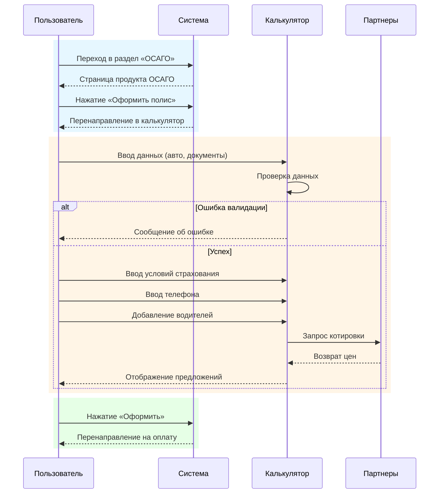

### 1. **Название проекта:**

Оформление и просмотр ОСАГО на платформе zaceni.ru

### 2. **Цель проекта:**

Реализовать функциональность, позволяющую авторизованному пользователю:

- Ознакомиться с продуктом ОСАГО;
    
- Рассчитать стоимость полиса;
    
- Перейти к его оформлению и оплате;
    
- Получить актуальные предложения от страховых компаний.
    

---

### 3. **Функциональные требования:**

#### 3.1 Авторизация

- Пользователь должен быть авторизован (предположительно реализовано в UC1).
    

#### 3.2 Навигация по ОСАГО

- Возможность попасть на страницу ОСАГО через:
    
    - Профиль (https://zaceni.ru/list)
        
    - Главную страницу ([https://zaceni.ru](https://zaceni.ru))
        
    - Поп-ап "Страховые продукты"
        
    - Кнопки на страницах: "ОСАГО", "Оформить", "Продлить", "Рассчитать стоимость"
        

#### 3.3 Калькулятор ОСАГО

- Автозаполнение данных авто по гос.номеру или VIN/шасси/кузову
    
- Запрос к API данных ТС
    
- Поля: транспортное средство, документ на ТС, условия страхования, телефон
    
- Возможность сохранения расчета
    
- Добавление до 4 водителей с обязательными полями
    
- Валидация всех полей
    
- Возможность автоподстановки данных из разделов "Мои Водители", "Мои Автомобили"
    

#### 3.4 Получение котировок

- Отправка данных в партнерские API
    
- Отображение списка предложений
    
- Обработка ошибок (недоступность API, отсутствие предложений)
    
- Переход к оформлению и оплате выбранного предложения
    

#### 3.5 Обработка ошибок

- Валидационные ошибки (подсветка, сообщения)
    
- Недоступность API
    
- Прерванная сессия (сохранение в sessionStorage)
    
- Ошибка отправки данных (лог + сообщение)
    

#### 3.6 Кросс-продукты

- На этапе оплаты – предложение оформить кросс-продукт
    

---

### 4. **Нефункциональные требования:**

- Высокая доступность и отказоустойчивость API
    
- Мобильная адаптация
    
- Безопасность персональных данных
    
- Поддержка автосохранения данных
    
- Время ответа от API — не более 3 секунд

### **5. Диаграмма последовательностей**

---

## ❓Вопросы к автору документа:

1. **Авторизация:**
    
    - Какие данные о пользователе доступны после авторизации?
        
    - Предусмотрен ли гостевой режим (без авторизации)?
        
2. **Данные ТС и водителей:**
    
    - Какие поля являются обязательными для каждого водителя?
        
    - Можно ли изменить уже введённые данные после расчета?
        
3. **Интеграции:**
    
    - Сколько страховых компаний планируется подключить?
        
    - Как обрабатывается ситуация, если один из API вернул ошибку?
        
4. **Калькулятор:**
    
    - Возможна ли обратная связь по введённым данным? Например, "Мы нашли ваш автомобиль: Toyota Corolla 2015".
        
5. **Кросс-продукты:**
    
    - Какие кросс-продукты предлагаются? Страхование жизни, КАСКО и т.д.?
        
    - Подключены ли они к тем же API или отдельным?
        
6. **Интерфейс:**
    
    - Должен ли пользователь видеть пошаговый прогресс оформления?
        
    - Как отображается информация по котировкам? Карточки? Таблица?
        
7. **Хранение данных:**
    
    - Как долго сохраняются расчёты и введённые данные в sessionStorage?
        
8. **Мобильная версия:**
    
    - Есть ли отдельные требования для отображения на мобильных устройствах?
        
9. **Юридические аспекты:**
    
    - Нужно ли пользователю подтверждать согласие с передачей данных в сторонние системы?
        
10. **Аналитика:**
    
	- Требуется ли сбор событий: просмотр страницы ОСАГО, клик по "Оформить", отправка формы и т.д.?
