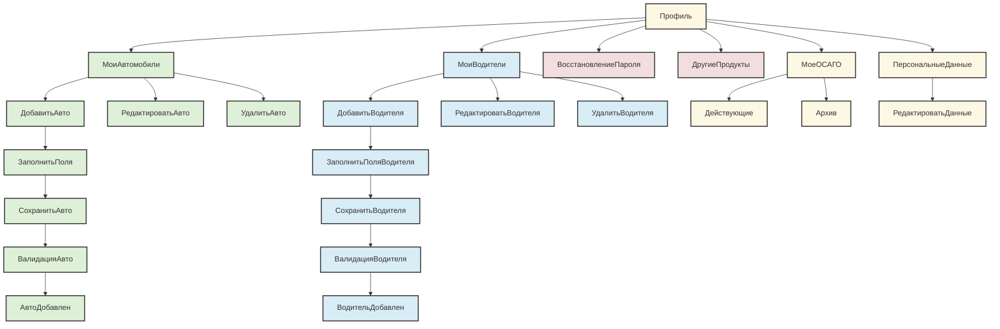
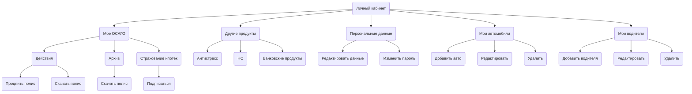

## 📄 **Техническое задание: Разработка раздела "Профиль пользователя"**

### 1. **Общее описание**

Реализовать функциональность управления профилем пользователя в рамках личного кабинета на сайте https://zaceni.ru/list. Авторизованный пользователь должен иметь доступ к следующим разделам:

- **Мое ОСАГО**: просмотр действующих и архивных полисов.
    
- **Мои автомобили**: управление списком автомобилей.
    
- **Мои водители**: управление списком водителей.
    
- **Персональные данные**: редактирование контактной информации, восстановление пароля.
    
- **Другие продукты**: переход к другим страховым продуктам сайта.
    

---

### 2. **Функциональные требования по разделам**

#### 2.1. **Мое ОСАГО**

- **Вкладка "Действуют"**:
    
    - Отображение: номер полиса, срок действия, страховая компания.
        
    - Кнопки:
        
        - `Продлить` → переход в UC2 (оформление полиса с автозаполнением).
            
        - `Скачать PDF`
            
        - `Поделиться`
            
- **Вкладка "Архив"**:
    
    - Отображение завершённых полисов и черновиков.
        
    - Доступные действия: `Редактировать`, `Использовать как черновик`, `Удалить`.
        
- **Автоматический перенос** просроченного полиса в "Архив".
    
- **Уведомление** за 7 дней до окончания срока полиса.
    

#### 2.2. **Мои автомобили**

- Кнопка `Добавить автомобиль`:
    
    - Ввод госномера или VIN → автозаполнение марки, модели, года выпуска, данных СТС через API.
        
    - В случае недоступности API — ввод вручную.
        
- Возможность `Редактировать` и `Удалить`.
    
- При попытке удалить автомобиль, участвующий в активном полисе → ошибка: _"ТС используется в полисе №XXX"_.
    

#### 2.3. **Мои водители**

- Кнопка `Добавить водителя`:
    
    - Ввод: ФИО, серия/номер прав, дата выдачи первых прав, дата рождения, паспортные данные.
        
- Возможность `Редактировать` и `Удалить`.
    
- Пользователь автоматически отображается как "Водитель 1".
    

#### 2.4. **Персональные данные**

- Редактирование: ФИО, email, телефон, адрес.
    
- Маски:
    
    - Email — проверка формата.
        
    - Телефон — маска `+7 XXX XXX-XX-XX`.
        
- Кнопка `Изменить пароль` → переход в UC1 (восстановление пароля).
    

#### 2.5. **Другие продукты**

- Боковое меню `Все продукты`: список ссылок на другие страховые продукты (например, "Страхование ипотеки", "Анти-клещ" и т.п.).
    
- Переходы на страницы продуктов либо по ссылкам, либо из попапа "Страховые продукты".
    

---

### 3. **Дополнительные функции**

- В разделах "Мое ОСАГО", "Мои водители", "Мои автомобили":
    
    - Кнопка `Новый расчет ОСАГО` → переход в UC2 с автоподстановкой данных.
        
- Сохранение ранее введённых данных в соответствующих разделах.
    

---

### 4. **Интеграции**

- **API проверки данных ТС** (автозаполнение по госномеру/VIN).
    
- **API проверки водительских прав**.
    
- Связь с:
    
    - **UC1** — восстановление пароля.
        
    - **UC2** — оформление полиса с автозаполнением.
        

---

### 5. **Требования к пользователю**

- Доступен только для авторизованных пользователей.
    
- Роль: клиент.
    

### 6. Диаграмма поведения

---

## ❓ Вопросы к автору документа

1. **Должны ли пользователи видеть историю своих действий (логирование)?**
    
2. **Нужно ли предусмотреть массовое удаление автомобилей или водителей?**
    
3. **Можно ли загружать документы (например, фото СТС, прав) для авто и водителей?**
    
4. **Нужно ли предусмотреть загрузку аватара пользователя?**
    
5. **Как отправляются уведомления за 7 дней до окончания полиса? Email, push, SMS?**
    
6. **Есть ли требования по кэшированию данных полисов, авто, водителей?**
    
7. **Что делать, если пользователь пытается редактировать данные, когда API недоступны?**
    
8. **Есть ли требование к отображению истории пролонгаций ОСАГО?**
    
9. **Нужна ли возможность фильтрации/поиска по спискам авто, водителей и полисов?**
    
10. **Нужен ли лог аутентификации/активных сессий в профиле пользователя?**